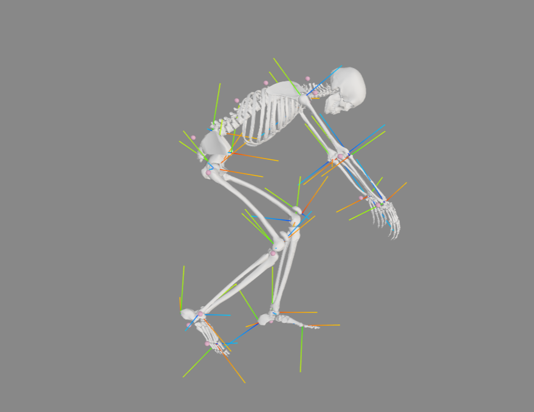

# 👋 Hi, I’m Pascal!
Studying Computer Science at ETH Zürich

Currently working on my thesis: Pose Estimation for Bike Fitting.

That's me cycling: 

---

In my free time, I explore how to make on-chain prediction market data more accessible and analyzable:

- **Polymarket Orderbook Collector** – Archives Polymarket order book data for analysis.  
  [GitHub Repo](https://github.com/PascalFewi/Polymarket_Orderbook_Collector) – Data coming soon.

- **Polymarket Trading Analytics** – Introduction to the collected data, Analysis Coming soon.  
  [GitHub Repo](https://github.com/PascalFewi/Polymarket_Trading)

Other projects:

- **[20min Fantasy](https://github.com/PascalFewi/20minfantasy)** – Optimized Squad Picking for  20 Min Fantasy Game. A knapsack approached best 11 picker 🤯

- **EM2024 Betting Odds Crawler** – Scrapes betting odds from Swisslos to find best bets for community betting 🤥.  
  [GitHub Repo](https://github.com/PascalFewi/EM2024_BettingOdds_Crawler)

- **Meischter-Rächnär** – A small web app that shows when FC Basel would officially become Swiss champion, based on user-selected match outcomes. 
  [GitHub Repo](https://github.com/PascalFewi/Meischter-Raechner) | [Live App](https://pascalfewi.github.io/Meischter-Raechner/)

Used to do some WordPress: 

- **MBImmoeasy** [www.mbimmoeasy.ch/](https://www.mbimmoeasy.ch/)
- **Druckerei Dietrich** [druckerei-dietrich.ch/](https://druckerei-dietrich.ch/)
- **Blueme Atelier** [blueme-atelier.ch/](https://blueme-atelier.ch/)

---

Always happy to connect or collaborate!
