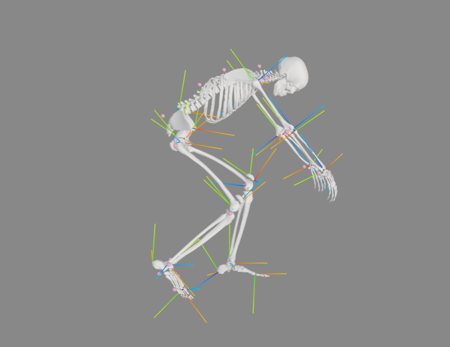

# 👋 Hi, I’m Pascal!
Studying Computer Science at ETH Zürich

I'm interested in analyzing and visualizing data as well as Computer Vision.
Usually about my favorite Sports (football / cycling / running) or more recently also on prediciton markets. 

Currently working on making my bachelor thesis "Pose Estimation for Bike Fitting" available. 

That's me cycling: 

---
Football ⚽ :

- **Meischter-Rächner** – An interactive table that shows based on the inputed outcomes form the user, when FC Basel would officially become Swiss champion. 
  [GitHub Repo](https://github.com/PascalFewi/Meischter-Raechner) | [Live App](https://pascalfewi.github.io/Meischter-Raechner/)

- **20min Fantasy Squad** – Tried to optimize my fantasy squad based on the performance of last season using a knapsack approach for points per cost.  [GitHub Repo](https://github.com/PascalFewi/20minfantasy)

- **Swisslos Odds Crawler** – Scrapes betting odds from Swisslos to find best bets. Project was used for the UEFA EUROS 2024. 
  [GitHub Repo](https://github.com/PascalFewi/EM2024_BettingOdds_Crawler)

PolyMarket 💠 : 

- **Polymarket Orderbook Collector** – Archives Polymarket order book data. Collects polymarket bets over the official polymarket websocket and arhcives it.   
  [GitHub Repo](https://github.com/PascalFewi/polymarket-data)

- **Polymarket Historical Orderbooks API** – Archived Data was made available over the following script. Find the documentation in the Repo, for accessing a sample portion of the data, that is public available.
  [GitHub Repo](https://github.com/PascalFewi/polymarket-api)

Used to do some WordPress: 

- **MBImmoeasy** [www.mbimmoeasy.ch/](https://www.mbimmoeasy.ch/)
- **Druckerei Dietrich** [druckerei-dietrich.ch/](https://druckerei-dietrich.ch/)
- **Blueme Atelier** [blueme-atelier.ch/](https://blueme-atelier.ch/)

---

Always happy to connect or collaborate!
