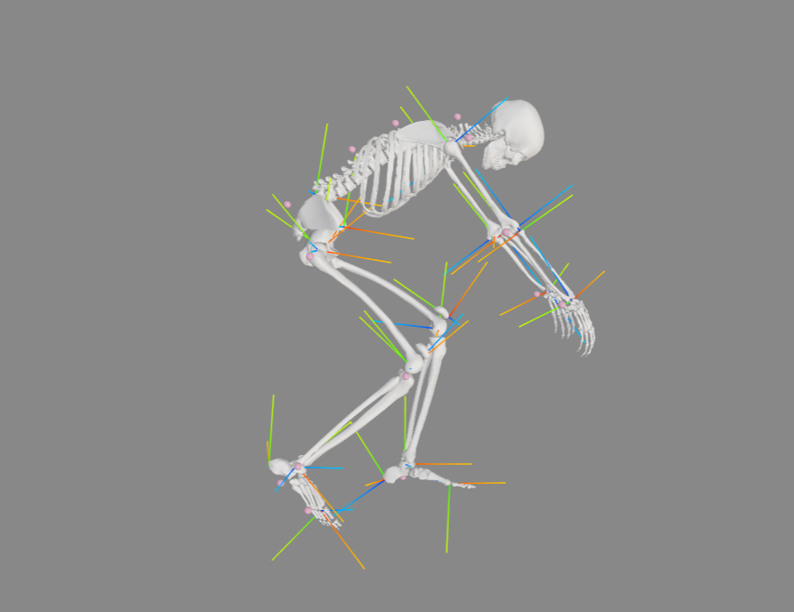

# 👋 Hi, I’m Pascal!
Studying Computer Science at ETH Zürich

I'm interested in ML, AI, as well as Computer Vision.
Usually about my favorite Sports (football / cycling) or more recently also on prediciton markets. 

Currently working on making my bachelor thesis "Pose Estimation for Bike Fitting" available. 

That's me cycling: 

---

Cycling 🚴 :
- **KOM QOM** – Explore Strava segments on an interactive map. 
  Find segments by panning/zooming, see stats (length, grade, elevation, KOM times) 
  and difficulty scores based on a physics model.
  [GitHub Repo](https://github.com/PascalFewi/komqom) | [Live App](https://komqom.app) (still restricted in Sandbox mode, waiting for Strava approval 😴. Also Strava will remove the `/exploreSegments` endpoint in september 2026 ... )

  
Football ⚽ :

- **SRF Tippspiel EV-Optimizer** – A layer on top of the odds-api.io API that computes the expected value of each possible scoreline for the SRF Tippspiel, and surfaces the tip that maximizes your expected points instead of just the most likely result.
  [GitHub Repo](https://github.com/PascalFewi/srf_tippspiel) | [Live App](https://pascalfewi.github.io/srf_tippspiel/)

- **Meischter-Rächner** – An interactive table that shows based on the inputed outcomes form the user, when FC Basel would officially become Swiss champion. 
  [GitHub Repo](https://github.com/PascalFewi/Meischter-Raechner) | [Live App](https://pascalfewi.github.io/Meischter-Raechner/)

- **20min Fantasy Squad** – Tried to optimize my fantasy squad based on the performance of last season using a knapsack approach for points per cost.  [GitHub Repo](https://github.com/PascalFewi/20minfantasy)

PolyMarket 💠 (Project stopped as too expensive) : 

- **Polymarket Orderbook Collector** – Archives Polymarket order book data. Collects polymarket bets over the official polymarket websocket and arhcives it.   
  [GitHub Repo](https://github.com/PascalFewi/polymarket-data)

- **Polymarket Historical Orderbooks API** – Archived Data was made available over the following script. Find the documentation in the Repo, for accessing a sample portion of the data, that is public available.
  [GitHub Repo](https://github.com/PascalFewi/polymarket-api) (Live Demo offline again. To much server costs 💸)

Some Wordpress / WebDev work for clients: 

- **Gedruckt in Basel.** [gedruckt-in-basel.ch/](https://gedruckt-in-basel.ch/)
- **Klick für Druck** [k-f-d.ch/](https://k-f-d.ch/)
- **Quartett Spiel** [auto-quartett.ch](auto-quartett.ch)
- **MBImmoeasy** [www.mbimmoeasy.ch/](https://www.mbimmoeasy.ch/)
- **Druckerei Dietrich** [druckerei-dietrich.ch/](https://druckerei-dietrich.ch/)
- **Blueme Atelier** [blueme-atelier.ch/](https://blueme-atelier.ch/)

---

Always happy to connect or collaborate!
